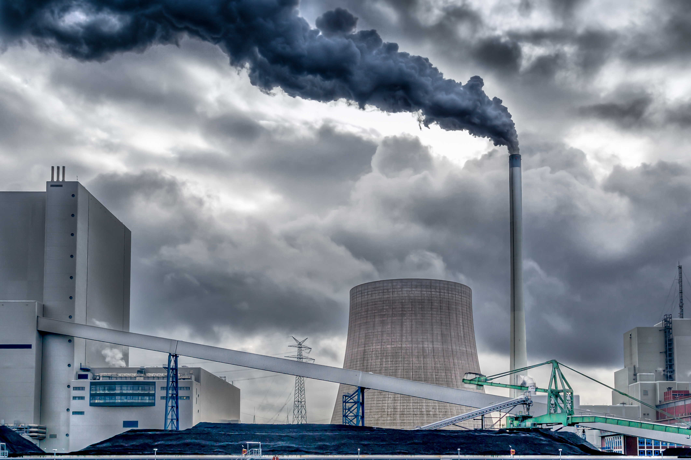

```{r setup, echo=FALSE, results='hide', message=FALSE, warning=FALSE}
# Če želimo nastaviti pisave v PDF-ju, odkomentiramo
# in sledimo navodilom v programu.
#source("fontconfig.r", encoding="UTF-8")

# Uvoz vseh potrebnih knjižnic
source("lib/libraries.r", encoding="UTF-8")
```

```{r rstudio, echo=FALSE, results='asis'}
# Izris povezave do RStudia na Binderju
source("lib/rstudio.r", encoding="UTF-8")
```

# 1. Uvod

Analiziral sem ekološke podatke držav Evropske unije. Za merilo ozaveščenosti sem izbral izdatke posamezne države za ekologijo, izmerjene vrednosti emisij treh najbolj škodljivih toplogrednih plinov, površino  pokrito z gozdom in pobrane davke s strani ekoloških dajatev. Zgoraj omenjene podatke sem primerjal z BDP-jem, številom prebivalcev in konsolidiranim državnim dolgom. Naredil sem tudi napovedi količine državnih izdatkov za ekologijo za Slovenijo in Nemčijo.



***

# 2. Obdelava, uvoz in čiščenje podatkov

```{r uvoz, echo=FALSE, message=FALSE}
source("uvoz/uvoz.r", encoding="UTF-8")
```

Podatke sem uvozil v obliki HTML in CSV, ki sem jih pridobil na spletni strani [World atlas](https://www.worldatlas.com/articles/european-countries-with-the-most-forest-cover.html) in v podatkovnih bazah Eurostat-a.
Sprva so bili podatki v šestih tabelah, ki sem jih uredil v šest razpredelnic v obliki *tidy data*:

1. `bdp` - podatki o bruto domačem proizvodu (BDP) držav Evropske unije (1998-2017)
  - `Drzava` - - spremenljivka: imena opazovanih držav, (neurejen faktor)
  - `Leto` - spremenljivka: leto testiranja, (število)
  - `BDP.E` - meritev: BDP v tekočih cenah v milijonih evrov, (število)
  
2. `emisije` - letne meritve  treh najškodljivejših toplogrednih plinov v ozračju po sektorjih gospodarstva 
  - `Drzava` - spremenljivka: imena opazovanih držav, (neurejen faktor)
  - `Leto` - spremenljivka: leto testiranja, (število)
  - `Sector.gospodarstva` - spremenljivka: sektor gospodarstva, ki je v zrak izpustil določeno količino plina, (neurejen faktor)
  - `skupne.emisije` - meritev: letna izmerjena količina v tonah, (število)

3. `gozd` - površina gozdnatih površin v kvadratnih kilometrih v letu 2017
  - `Drzava` - spremenljivka: imena opazovanih držav, (neurejen faktor)
  - `Povrsina.gozda` - meritev: skupna površina v kvadratnih kilometrih, (število)

4. `eko.potrosnja` - letni državni izdatki za ekologijo (1998-2017)
  - `Drzava` - spremenljivka: imena opazovanih držav, (neurejen faktor)
  - `Leto` - spremenljivka: leto testiranja, (število)
  - `Izdatki.za.ekologijio` - meritev: izdatki (potrošnja) držav za ekologijo v milijonih evrov, (število)
  
5. `populacija` - število prebivalcev držav Evropske unije (1998-2017)
  - `Drzava` - spremenljivka: imena opazovanih držav, (neurejen faktor)
  - `Leto` - spremenljivka: leto testiranja, (število)
  - `Stevilo.prebivalcev` - meritev: število prebivalcev, (število)

6. `eko.davki` - letni državni prihodki s strani ekoloških davkov za podjetja in posameznike
  - `Drzava` - spremenljivka: imena opazovanih držav, (neurejen faktor)
  - `Leto` - spremenljivka: leto testiranja, (število)
  - `Pobrani.davki` - meritev: vrednost pobranih ekoloških davkov v milijonih evrov, (število)


```{r vizualizacija, echo=FALSE, message=FALSE, results='hide', warning=FALSE}
source('vizualizacija/vizualizacija.r', encoding='UTF-8')
```


***

# 3. Analiza in vizualizacija podatkov
## 3.1 Slovenija

Spodnji graf prikazuje skupne vrednosti emisij treh okolju najbolj škodljivih toplogrednih plinov v Sloveniji med letoma 2008 in 2017. Lepo je razvidno upadanje megaton emisij med letoma 2018 in 2014, z manjšim porastom v letu 2011. Med letoma 2014 in 2016 je, zanimivo, prišlo do porasta, nato pa so se vrednosti ponovno začele zmanjševati.

Drugi graf nam, kot nadaljevanje prvega, prikazuje letne vrednosti državnih prihodkov s strani ekoloških davkov ekoloških davkov v letih 2008 do 2017. Razlog za porast emisij v letu 2011, bi seveda lahko razložili z omilitvijo ekoloških davkov v tem letu. Nato pa je opazen močan porast pobranih davkov v prihodnjih letih, kar bi vsekakor lahko utemeljili z vedno večjim zavzemanjem za ohranjanje okolja.

```{r graf.emisije.slo, echo=FALSE, message=FALSE, error=FALSE, warning=FALSE, fig.align='center', fig.height=6}
plot(graf.emisije.slo)
```

```{r graf.davki.slo, echo=FALSE, message=FALSE, error=FALSE, warning=FALSE, fig.align='center', fig.height=6}
plot(graf.davki.slo)
```

## 3.2. Primerjava Slovenije z državami EU
Zavedajoč se, da so toplogredni plini globalen problem, je na tem mestu primerna primerjava izpustov Slovenije z ostalimi državami Evropske unije. Sprva je tu zemljevid Evrope, ki prikazuje bruto domači proizvod (BDP) držav EU v letu 2017. Med države z najnižjim BDP-jem uvrščamo Črno Goro, Lihtenštajn, Kosovo; med tiste z najvišjim pa Nemčijo, Združeno kraljestvo, Francijo in Italijo.

```{r zemljevid.bdp.2017, echo=FALSE, message=FALSE, error=FALSE, warning=FALSE, fig.align='center', fig.height=6.5}
plot(zemljevid.bdp.2017)
```

Seveda zgolj skupna količina izpustov ni primerljiv podatek, zato sem se odločil primerjati države glede na kazalnik: skupna vrednost emisij / BDP.
Kazalnik Slovenije znaša 282,3916 ton na milijon evrov BDP, kar jo uvršča rahlo pod evropsko povprečje. Iz povprečja močno izstopajo Bolgarija, Estonija in Poljska, medtem ko je, glede na ta kazalnik najbolj ekološka država Švedska.

```{r graf.emisije.v.bdp.2017, echo=FALSE, message=FALSE, error=FALSE, warning=FALSE, fig.align='center', fig.height=7, fig.width=8}
plot(graf.emisije.v.bdp.2017)
```

Pomemben pokazatelj ekološke ozaveščenosti držav je tudi znesek, ki ga posamezna država nameni za ekologijo (t.i. ekološki izdatki). Tu so vštete razne subvencije za nakup električnih avtomobilov, energetske sanacije stavb, subvencije podjetjem za izboljšanje proizvodnje in davčne olajšave podjetjem v primeru izpolnjevanja ekoloških standardov. Podobno kot zgoraj, nam sam podatek o neto izdatkih ne pove prav dosti, zato sem ponovno izračunal indeks izdatkov za ekologijo glede na BDP.
Najbolj (v negativnem smislu) izstopa Irska, med tiste z najvišji indeksi pa se uvrščajo Belgija, Avstrija in zanimivo tudi Češka, ki je bila na visokem četrtem mestu po izpustu emisij. Visok koeficient izdatkov v BDP-ju Češke je torej razumljiv in obeta zmanjšanje onesnaževanja v prihodnjih letih.


```{r zemljevid.izdatki.v.bdp.2016, echo=FALSE, message=FALSE, error=FALSE, warning=FALSE, fig.align='center', fig.height=6.5}
plot(zemljevid.izdatki.v.bdp.2016)
```

## 3.3. Korelacija med ekološkimi davki in vrednostjo emisij (2008-2017), Plotly
Spodnji interaktivni diagram prikazuje spreminjanje vrednosti pobranih ekoloških davkov v milijardah evrov in količine emisij v megatonah od 2008 do 2017.
```{r plotly.graf2, echo=FALSE, message=FALSE, error=FALSE, warning=FALSE, fig.align='center', fig.height=7, fig.cap= 'Podobnosti med državami glede na vrednost emisij in pobrane davke'}
plotly.graf2
```


## 3.4. Razvrščanje držav glede na BDP in izpuščene emisije
Zanimalo me je katere države so si med seboj podobne glede na izpuščene emisije in BDP. Zato sem jih na grupiral v pet skupin, kar je lepo razvidno na spodnjem zemljevidu. Opazimo lahko, da ponovno izstopa Nemčija, kateri glede na analizirane podatke ni podobne države. Največjo skupino sestavljajo države označene z roza barvo (jugovzhodna Evropa in Skandinavija).

```{r zemljevid.cluster, echo=FALSE, message=FALSE, error=FALSE, warning=FALSE, fig.align='center', fig.height=6.5}
print(zemljevid.cluster)
```

## 3.5. Vrednost emisij glede na površino gozdnatih površin
V analizi sem pogledal tudi, kako se je ekosistem posameznih držav sposoben samoobnavljati. Pomembno informacijo o tem lahko dobimo iz površine gozdnatih površin posamezne države, saj so ravno rastline tiste, ki ogljikov dioksid porablajo za fotosintezo in nato sproščajo kisik. Zato sem primerjal vrednosti sproščenih emisij v ozračje s površino gozda v posamezni državi. 

V spodnjem grafu zaradi preglednosti nisem prikazal Malte in Nizozemske, saj njune vrednosti izjemno izstopata. To je povsem razumljivo, saj ima Malta zaradi svoje geografske lege in podnebja zelo malo gozdov.Prav tako pa ima tudi Nizozemska zelo malo gozda (3760 kvadratnih kilometov) primerjajoč ga s skoraj 150 megatonami emisij. Slovenija se predvsem zaradi svoje izjemne gozdnatosti uvršča med najboljših sedem držav v tem pogledu.

```{r graf.gozd.emisije, echo=FALSE, message=FALSE, error=FALSE, warning=FALSE, fig.align='center', fig.height=6.5}
plot(graf.gozd.emisije)
```


***

# 4. Napredna analiza podatkov

Največje vprašanje pri globalnem segrevanju je, kaj bomo storili v prihodnosti. Vsekakor so potrebne investicije za ohranitev planeta, zato sem skušal s pomočjo dostopnih podatkov do leta 2017 napovedati, kako se bo gibala vrednost državnih izdatkov za ekologijo do leta 2021.

Sprva sem pogledal podatke za Slovenijo, a glede na precejšnjo volatilnost v preteklih letih (nekatere podatkovne točke padejo izven območja napake), lahko opazimo, da prileganje ni ravno najboljše.

Zato sem se odločil narediti napoved še za nemško gospodarstvo. Tu je bilo nihanja precej manj, prav tako pa so se državni izdatki za ekologijo linearno povečevali, kar je vsekakor pričakovano tudi v prihodnosti, saj gre za enega izmed največji akterjev v evropskem gospodarskem in političnem prostoru.


```{r analiza, echo=FALSE, message=FALSE}
source("analiza/analiza.r", encoding="UTF-8")
```

```{r graf.napovedi.praga.slo, echo=FALSE, fig.align='center'}
plot(graf.napovedi.praga.slo)
```

```{r graf.napovedi.praga.nem, echo=FALSE, fig.align='center'}
plot(graf.napovedi.praga.nem)
```

***
# 5. Shiny
Za interaktivno vizualizacijo podatkov sem naredil shiny aplikacijo, ki prikazuje še en pomemben kazalnik. Skozi leta sem prikazal gibanje vrednosti emisij na prebivalca.

```{r shiny, echo=FALSE}
shinyAppDir("shiny", options=list(width="100%", height=720))
```

***
# 6. Zaključek

Iz dane analize, lahko vidimo, da se ekološke situacije v državah EU začenjajo izboljševati. V analizi sem sicer vzel zgolj države EU, kar je v posameznih segmentih lahko premalo, sploh ker je globalno segrevanje problem celotnega planeta. A vseeno sem iz podatkov za Evropsko unijo lahko ugotovil precej zanimivih stvari. Iz zgleda preteklih dogodkov v Sloveniji lahko vidimo, kako pozitivno vpliva zvišanje eko-davkov na zmanjšanje vrednosti emisij. V večih segmentih analize je izstopala Švedska, ki je lahko zgled ostalim državam. Iz napovedi za prihodnja leta lahko sklepamo na povečanje izdatkov za ohranjanje okolja vseh držav, saj morajo prav pri problemu globalnega segrevanja stopiti skupaj in delovati kot celota preden bo prepozno.
